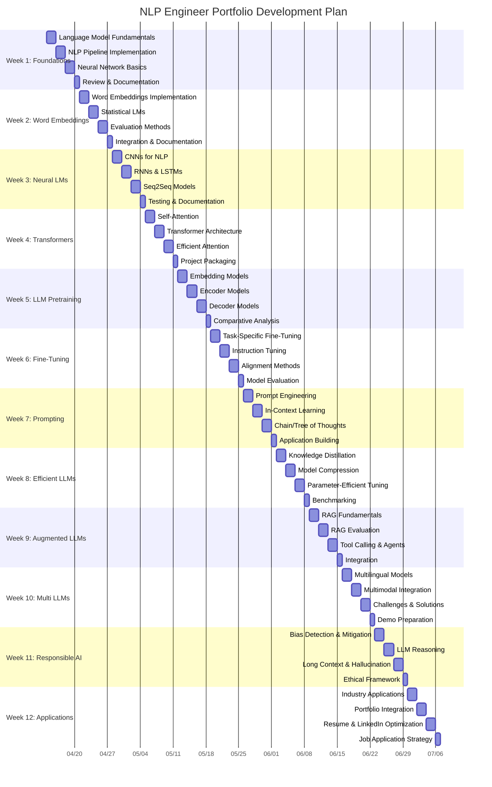

# NLP-Engineer-Portfolio
# NLP Engineer Portfolio Development

This repository contains my journey to becoming an NLP Engineer, following a structured 12-week plan based on the book "Introduction to Large Language Models (LLMs)".

## 📊 Progress Overview

## 📅 Weekly Plan and Progress

### Week 1: Foundations & Language Modeling Basics
**Book Chapters:** 1 & 2 (Introduction + NLP & Neural Networks Overview)

| Day | Learning Focus | Tasks | Status | Project Deliverable | Completion |
|-----|---------------|-------|--------|---------------------|------------|
| 1-2 | Language Model Fundamentals | Study Ch. 1, research evolution of LLMs | ⬜ In Progress | GitHub repo structure, portfolio website skeleton | ⬜ 0% |
| 3-4 | NLP Pipeline | Study Ch. 2 (Part I), implement basic pipeline | ⬜ Not Started | NLP Pipeline demo | ⬜ 0% |
| 5-6 | Neural Network Basics | Study Ch. 2 (Part II), implement perceptron | ⬜ Not Started | Interactive neural network visualization tool | ⬜ 0% |
| 7 | Review & Documentation | Document learning, prepare blog post | ⬜ Not Started | Blog: "Evolution of Language Models" | ⬜ 0% |

**Week 1 Progress:** ⬜ 0% complete

**Notes & Learnings:**
- (Add your notes and learnings here)

### Week 2: Word Embeddings & Statistical Language Models
**Book Chapters:** 3 & 4

| Day | Learning Focus | Tasks | Status | Project Deliverable | Completion |
|-----|---------------|-------|--------|---------------------|------------|
| 1-2 | Word Embeddings | Study Ch. 3, implement Word2Vec | ⬜ Not Started | Word embedding visualization tool | ⬜ 0% |
| 3-4 | Statistical LMs | Study Ch. 4, implement n-gram models | ⬜ Not Started | N-gram text generator | ⬜ 0% |
| 5-6 | Evaluation Methods | Implement perplexity and other metrics | ⬜ Not Started | Model comparison dashboard | ⬜ 0% |
| 7 | Integration & Documentation | Combine components, write documentation | ⬜ Not Started | GitHub README updates, blog post | ⬜ 0% |

**Week 2 Progress:** ⬜ 0% complete

**Notes & Learnings:**
- (Add your notes and learnings here)

### Week 3: Neural Language Models
**Book Chapter:** 5

| Day | Learning Focus | Tasks | Status | Project Deliverable | Completion |
|-----|---------------|-------|--------|---------------------|------------|
| 1-2 | CNNs for NLP | Study Ch. 5.1, implement text CNN | ⬜ Not Started | Text classifier using CNN | ⬜ 0% |
| 3-4 | RNNs & LSTMs | Study Ch. 5.2, implement RNN/LSTM | ⬜ Not Started | Character-level text generator | ⬜ 0% |
| 5-6 | Seq2Seq Models | Study Ch. 5.3-5.4, implement attention | ⬜ Not Started | Simple machine translation system | ⬜ 0% |
| 7 | Testing & Documentation | Test models, document results | ⬜ Not Started | Technical blog post | ⬜ 0% |

**Week 3 Progress:** ⬜ 0% complete

**Notes & Learnings:**
- (Add your notes and learnings here)

### Week 4: Transformers
**Book Chapter:** 6

| Day | Learning Focus | Tasks | Status | Project Deliverable | Completion |
|-----|---------------|-------|--------|---------------------|------------|
| 1-2 | Self-Attention | Study Ch. 6.1-6.2, implement self-attention | ⬜ Not Started | Self-attention visualization tool | ⬜ 0% |
| 3-4 | Transformer Architecture | Study Ch. 6.3-6.4, implement components | ⬜ Not Started | Small-scale transformer | ⬜ 0% |
| 5-6 | Efficient Attention | Study Ch. 6.5-6.6, optimize transformer | ⬜ Not Started | Memory-efficient implementation | ⬜ 0% |
| 7 | Project Packaging | Package code, create demos | ⬜ Not Started | "Transformers from Scratch" repo | ⬜ 0% |

**Week 4 Progress:** ⬜ 0% complete

**Notes & Learnings:**
- (Add your notes and learnings here)

### Week 5-12: (Follow same format for remaining weeks)
...

## 📈 Skills Development Tracker

### Technical Skills
- [ ] Text preprocessing and normalization
- [ ] Word embeddings and text representations
- [ ] Statistical language modeling
- [ ] Neural language modeling
- [ ] Transformer architectures
- [ ] Fine-tuning pre-trained models
- [ ] Prompt engineering
- [ ] Retrieval-augmented generation
- [ ] Model optimization techniques
- [ ] LLM evaluation frameworks

### Tools & Frameworks
- [ ] NLTK
- [ ] spaCy
- [ ] Hugging Face Transformers
- [ ] PyTorch
- [ ] TensorFlow/Keras
- [ ] FastAPI/Flask
- [ ] Docker
- [ ] Cloud deployment

### Professional Development
- [ ] Portfolio website creation
- [ ] Technical blog posts (Target: 12)
- [ ] LinkedIn profile optimization
- [ ] GitHub profile enhancement
- [ ] ATS-optimized resume
- [ ] Mock interviews completed (Target: 6)

## 🏆 Projects Showcase

| Project | Description | Status | Demo Link | Repository |
|---------|-------------|--------|----------|------------|
| NLP Pipeline | Comprehensive text processing pipeline | ⬜ Not Started | - | - |
| Word Embedding Visualizer | Interactive tool to explore word relationships | ⬜ Not Started | - | - |
| Neural Text Generator | Character-level text generation with RNN/LSTM | ⬜ Not Started | - | - |
| Transformer Implementation | Transformer built from scratch | ⬜ Not Started | - | - |
| Custom Fine-Tuned Model | Domain-specific model fine-tuning | ⬜ Not Started | - | - |
| Prompt Engineering Studio | Interactive prompt design and testing | ⬜ Not Started | - | - |
| Model Optimization Framework | Tools for distillation and quantization | ⬜ Not Started | - | - |
| RAG-Enhanced Agent | Document QA system with retrieval | ⬜ Not Started | - | - |
| Multilingual Assistant | Text processing across multiple languages | ⬜ Not Started | - | - |
| Bias Detection Toolkit | Tools to measure and mitigate bias | ⬜ Not Started | - | - |
| Industry Application | Domain-specific NLP system | ⬜ Not Started | - | - |

## 📝 Blog Posts & Articles

| Title | Published Date | Status | Link |
|-------|---------------|--------|------|
| Evolution of Language Models | - | ⬜ Not Started | - |
| Understanding Word Embeddings | - | ⬜ Not Started | - |
| Neural Networks for Text | - | ⬜ Not Started | - |
| ... | ... | ... | ... |

## 🔗 Resources & References

- [Introduction to Large Language Models (LLMs) - Book](https://link-to-book)
- [My Learning Notes](link-to-notes-repo)
- [Hugging Face Documentation](https://huggingface.co/docs)
- [PyTorch Tutorials](https://pytorch.org/tutorials/)
- [Papers & Research References](link-to-your-references)
